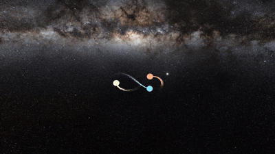

# 🌌 Real Time N-Body Gravitational Simulator

This project is a **real-time, interactive 3D simulation** of the N-body problem, built in **C++** and **OpenGL**.  
It features a **physics engine** and a **multi-pass rendering pipeline** with  visual effects to create a beautiful and physically plausible visualization of celestial mechanics.

---

## 📺 Demos, Videos & Updates
For videos of the simulation, and other development updates, please check out my social media profiles. I regularly post progress and results there.

- [LinkedIn](https://www.linkedin.com/in/shamilmannarottil/)  
- [X (formerly Twitter)](https://x.com/finn7199)

---

## 📜 Project Report
A comprehensive academic style paper has been written to accompany this project. The report provides a deep dive into the **underlying physics, rendering techniques, mathematical formulas**, and the **results of the simulations**.

➡️ **[Read the Full Project Report (PDF)](./docs/ThreeBodyProblem_v1.pdf)**

---

## ✨ Key Features
### Physics Engine
- **Multiple Integrators**: Implementations for Euler, Leapfrog, and Runge-Kutta 4th Order for comparative analysis.  
- **Energy Conservation Verification**: Logging system to plot and verify that RK4 and Leapfrog conserve total system energy.  
- **Modular Scenarios**: Flexible system for loading different initial conditions.  

### Rendering Engine
- **OpenGL**: Renderer using OpenGL.  
- **HDR & Post-Processing**: Multi-pass pipeline rendering to an HDR framebuffer to support advanced effects.  
- **Blinn-Phong Lighting**: Robust and efficient direct illumination.  
- **Image-Based Lighting (IBL)**: Pre-computed irradiance maps from the skybox for realistic ambient light.  
- **Bloom**: Separable Gaussian blur for a beautiful glow around emissive objects.  
- **Particle System**: Dynamic trails to visualize orbital paths of celestial bodies.  

---

## 📧 Contact
If you’d like to learn more, collaborate, or just chat about graphics, feel free to connect via:  
- [LinkedIn](https://www.linkedin.com/in/shamilmannarottil/)  
- [X (formerly Twitter)](https://x.com/finn7199)  

---

## 📄 License
This project is licensed under the **MIT License** - see the [LICENSE](./LICENSE) file for details.  
